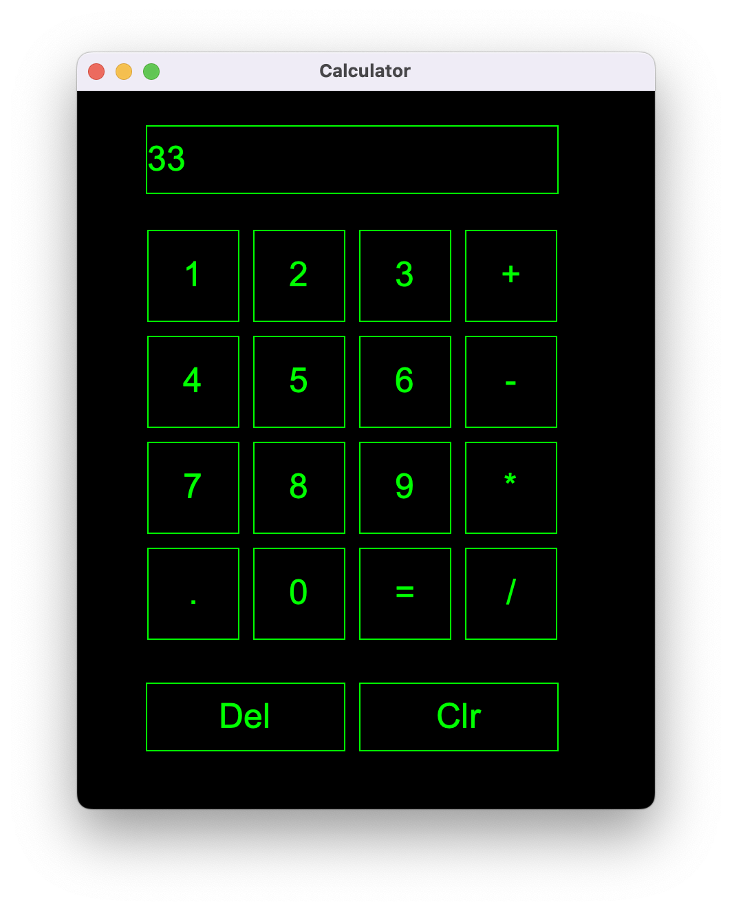

# Calculator With Java's GUI

The following is the code for a simple calculator that was done in winter 2021. This is a simple version of a calculator and was made to build more familiarity with java's GUI and its pretty straight-forward.

## How the calculator looks like:

